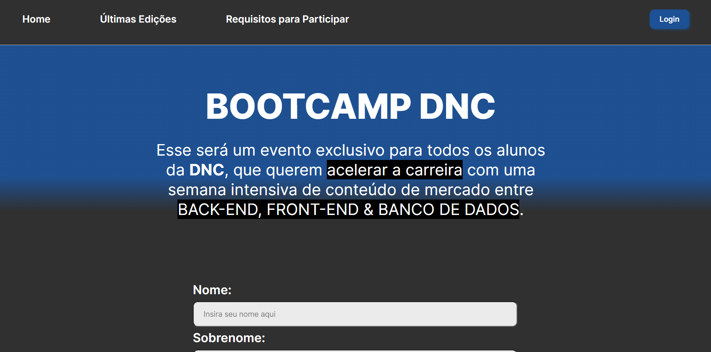

	

	<h1>Site de cadastramento para um Bootcamp fictício da Escola DNC</h1>

### O que é? 🤔
Site de cadastramento para um Bootcamp fictício da Escola DNC, foi utilizado html e css, ele não tem integração com outros recursos, é apenas uma exposição para treinamento focado em css.

### Quais tecnologias foram usadas? 💻
- HTML5
- CSS3

### Está online? 📡
SIM! Basta [clicar aqui](bootcamp-dnc-css.netlify.app) para visualizar o site que está hospedado nos servidores da Netlify.

by Murillo Couto 
[GitHub](https://github.com/MurilloCouto)
